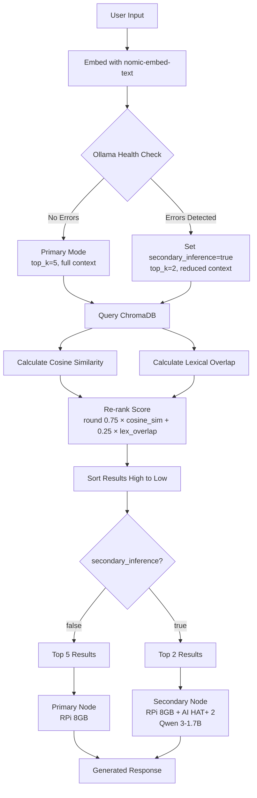

# RAG System for Edge-Deployed AI Agents

A lightweight system designed with AI agents on constrained hardware in mind.

Requirements:
- Ollama with `nomic-embed-text` pulled
- ChromaDB
- Raspberry Pi AI HAT+ 2 on secondary node for fail-over
- Hailo-Ollama on secondary node for fail-over
- OpenClaw
- At least Python 3.13.5

---

## Overview

This system was designed to run on dual Raspberry Pi 5's (8GB) with OpenClaw. It is able to detect some Ollama errors and fallback to the secondary Raspberry Pi for inference. The second Raspberry Pi uses the AI HAT+ 2 with Qwen 3-1.7B for the generation aspect of the RAG.

When it falls back to the secondary Pi it adjusts parameters as necessary to accommodate the Hailo-10H's restrictions i.e. reduced context size (max 2048 tokens), smaller models, and Hailo-Ollama's difficulty handling newlines in the prompt.

---

## Features

- Detects Ollama errors (rate limiting, billing issues, etc) and switches to backup automatically
- Uses cosine similarity and lexical matching (75-25 split) to rank documents
- Uses the AI HAT+ 2 to offload model inference to free up the CPU and RAM

---

## Architecture
 

---

## Setup

Raspberry Pi 5 with Debian GNU/Linux 13 (trixie)
Secondary node is a second Raspberry Pi 5 with the AI HAT+ 2.

Run `export RAG_WORKSPACE="/path/to/rag/"` on the primary node if you'll use this by itself. 
Otherwise it'll default to `~/.openclaw/workspace/rag/corpus/` for OpenClaw agents.
Change the IP, port, and HAILO_model to match your endpoint in `rag_core.py`.
Use `python rag_ingest.py --all` to ingest your documents 
